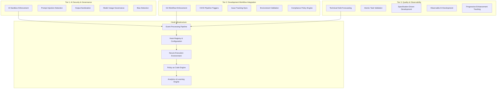

# Claude Code Hooks System: Enterprise AI Development Governance

## Executive Summary

Transform Claude Code from an AI assistant into a governed, observable, and integrated development platform through a sophisticated hooks system. This system provides deterministic control over AI-assisted development workflows while maintaining security, compliance, and quality standards at enterprise scale.

### Vision Statement
Enable organizations to harness AI development capabilities while maintaining complete control over security, quality, compliance, and integration with existing development infrastructure.

### Business Value Proposition
- **Risk Reduction**: Automated security and compliance enforcement
- **Quality Improvement**: Consistent standards and automated validation  
- **Cost Control**: Usage monitoring and budget enforcement
- **Productivity Gains**: Automated workflows and reduced manual processes
- **Audit Compliance**: Complete audit trails and governance documentation

## Problem Statement

### Current AI Development Challenges

**1. AI Governance Crisis**
- AI agents can bypass traditional quality gates and security measures
- Lack of audit trails for AI-generated decisions and code
- Difficulty enforcing organizational standards consistently
- Risk of prompt injection and AI model manipulation
- No cost controls or usage governance

**2. Integration Debt**  
- AI tools operate in isolation from existing development infrastructure
- Manual validation processes that don't scale
- Disconnected from compliance and governance systems
- Limited visibility into AI effectiveness and ROI
- Fragmented toolchain with multiple AI assistants

**3. Quality Control at Scale**
- Inconsistent code quality from AI assistance
- Technical debt accumulation from rapid AI development
- Insufficient automated validation of AI outputs
- Need for context-aware quality standards
- Lack of learning and improvement mechanisms

## Architecture Overview

### Three-Tier Hook System Architecture



## Core Components

### Tier 1: AI Security & Governance Hooks

#### AI Sandbox Enforcement
**Purpose**: Validate network isolation and credential protection
**Implementation**:
```json
{
  "hooks": {
    "PreToolUse": [
      {
        "matcher": "Bash|Write|Edit",
        "hooks": [
          {
            "type": "command",
            "command": "security-sandbox-check.sh",
            "blocking": true,
            "timeout": 5000
          }
        ]
      }
    ]
  }
}
```

#### Prompt Injection Detection
**Purpose**: Scan for malicious prompts before execution
**Features**:
- Pattern matching for common injection techniques
- ML-based anomaly detection
- Context-aware threat assessment
- Real-time blocking with detailed logs

#### Model Usage Governance
**Purpose**: Track and limit AI model usage by cost/policy
**Capabilities**:
- Real-time cost tracking per user/project
- Budget enforcement with automatic cutoffs
- Usage analytics and optimization recommendations
- Compliance reporting for audit purposes

#### Output Sanitization
**Purpose**: Validate AI-generated content for security issues
**Validation Types**:
- Secret detection (API keys, passwords, tokens)
- PII identification and redaction
- Malicious code pattern detection
- License compliance verification

#### Bias Detection Framework
**Purpose**: Monitor AI outputs for bias patterns
**Monitoring Areas**:
- Language bias in documentation
- Algorithmic bias in generated code
- Cultural bias in naming conventions
- Accessibility compliance validation

### Tier 2: Development Workflow Integration

#### Git Workflow Enforcement
**Purpose**: Validate branch naming, commit messages, PR requirements
**Enforcement Rules**:
```bash
# Branch naming convention
feature/JIRA-123-short-description
hotfix/JIRA-456-critical-fix

# Commit message format
type(scope): description [JIRA-123]

# Required PR checks
- Security scan passed
- Quality gates met
- Tests passing
- Documentation updated
```

#### CI/CD Pipeline Orchestration
**Purpose**: Automatically trigger builds, tests, deployments
**Integration Points**:
- GitHub Actions workflow triggers
- Jenkins pipeline automation
- Docker image building and scanning
- Kubernetes deployment validation
- Infrastructure as Code updates

#### Issue Tracking Synchronization
**Purpose**: Link AI-generated code to tickets, update status
**Supported Systems**:
- Jira integration with automated updates
- GitHub Issues linking and status sync
- Azure DevOps work item tracking
- Linear task management
- Custom webhook integrations

#### Environment Validation
**Purpose**: Ensure correct deployment targets and configurations
**Validation Checks**:
- Environment-specific configuration validation
- Resource limit compliance
- Security policy adherence
- Dependency version compatibility
- Performance baseline requirements

#### Compliance Policy Engine
**Purpose**: Automated GDPR, SOX, security policy enforcement
**Policy Categories**:
- Data privacy and protection (GDPR, CCPA)
- Financial compliance (SOX, PCI-DSS)
- Security standards (ISO 27001, NIST)
- Industry regulations (HIPAA, FDA)
- Internal governance policies

### Tier 3: Quality & Observability Framework

#### Technical Debt Forecasting
**Purpose**: Analyze code quality trends, predict maintenance costs
**Analytics Capabilities**:
- Code complexity trend analysis
- Maintenance cost prediction modeling
- Technical debt prioritization
- Refactoring opportunity identification
- ROI analysis for quality improvements

#### Atomic Task Validation
**Purpose**: Ensure AI tasks are properly sized (4-8 hours from patterns)
**Validation Criteria**:
- Task complexity assessment
- Scope boundary validation
- Dependency analysis
- Risk factor evaluation
- Resource requirement estimation

#### Specification-Driven Development
**Purpose**: Validate AI outputs against formal specifications
**Validation Framework**:
- Requirements traceability matrix
- Acceptance criteria verification
- API contract validation
- User story completion tracking
- Business rule compliance

#### Observable AI Development
**Purpose**: Comprehensive logging, metrics, and analytics
**Observability Pillars**:
- Detailed audit trails for all AI actions
- Performance metrics and SLA tracking
- Error analysis and pattern detection
- Usage analytics and optimization insights
- Cost attribution and ROI measurement

#### Progressive Enhancement Tracking
**Purpose**: Monitor incremental improvement patterns
**Tracking Metrics**:
- Code quality improvement trends
- Development velocity acceleration
- Error reduction patterns
- Knowledge transfer effectiveness
- Team productivity enhancement

## Advanced Hook Patterns

### Compositional Hook Chains
Create sophisticated validation pipelines:
```json
{
  "hooks": {
    "PreToolUse": [
      {
        "matcher": "Edit",
        "pipeline": [
          {
            "hook": "security-scan",
            "blocking": true,
            "timeout": 10000,
            "retry": 3
          },
          {
            "hook": "quality-check", 
            "blocking": false,
            "async": true
          },
          {
            "hook": "compliance-validate",
            "blocking": true,
            "cache": true
          },
          {
            "hook": "cost-track",
            "blocking": false,
            "priority": "low"
          }
        ]
      }
    ]
  }
}
```

### Context-Aware Policy Engine
Hooks that adapt based on environmental factors:
```json
{
  "policies": {
    "development": {
      "security": "relaxed",
      "quality": "standard",
      "compliance": "basic"
    },
    "staging": {
      "security": "strict",
      "quality": "enhanced", 
      "compliance": "full"
    },
    "production": {
      "security": "maximum",
      "quality": "enterprise",
      "compliance": "audit-ready"
    }
  }
}
```

### Learning and Adaptive Hooks
Self-improving validation system:
```json
{
  "learning": {
    "false_positive_threshold": 0.05,
    "adaptation_period": "weekly",
    "feedback_integration": true,
    "pattern_recognition": {
      "enabled": true,
      "confidence_threshold": 0.8,
      "auto_update": false
    }
  }
}
```

## Integration with Existing Commands

### Enhanced `/xquality` as Hook
Transform quality checking into automated governance:
```bash
# Pre-commit quality gates
/xquality --hook --trigger pre-commit --blocking

# Continuous quality monitoring  
/xquality --hook --trigger file-change --async

# Quality trend analysis
/xquality --hook --trigger daily --analytics

# Automated quality remediation
/xquality --hook --trigger quality-failure --auto-fix
```

### Enhanced `/xsecurity` as Hook
Security scanning as automated protection:
```bash
# Real-time security scanning
/xsecurity --hook --trigger tool-use --blocking

# Vulnerability trend tracking
/xsecurity --hook --trigger weekly --trend-analysis

# Security policy enforcement
/xsecurity --hook --trigger pre-deploy --policy-check

# Incident response automation
/xsecurity --hook --trigger security-event --auto-respond
```

### Enhanced `/xtest` as Hook
Testing automation and enforcement:
```bash
# Test-driven development enforcement
/xtest --hook --trigger pre-commit --tdd-validation

# Coverage requirement validation
/xtest --hook --trigger pr-create --coverage-gate

# Performance regression detection
/xtest --hook --trigger deploy --performance-check

# Test quality analysis
/xtest --hook --trigger test-run --quality-metrics
```

## Implementation Roadmap

### Phase 1: Foundation Infrastructure (2-3 weeks)

#### Week 1: Core Infrastructure
- [ ] Design and implement hook registry system
- [ ] Create configuration management framework
- [ ] Build event processing pipeline
- [ ] Implement basic security sandbox

#### Week 2: Hook Management
- [ ] Develop `/xhooks` command for lifecycle management
- [ ] Create hook execution environment
- [ ] Implement configuration validation
- [ ] Build basic monitoring and logging

#### Week 3: Integration & Testing
- [ ] Integrate with existing Claude Code commands
- [ ] Create basic hook examples
- [ ] Implement error handling and recovery
- [ ] Performance testing and optimization

### Phase 2: Core Hook Library (4-6 weeks)

#### Weeks 4-5: AI Governance Hooks
- [ ] AI Security Sandbox enforcement
- [ ] Prompt injection detection system
- [ ] Model usage governance and cost tracking
- [ ] Output sanitization framework
- [ ] Basic bias detection patterns

#### Weeks 6-7: Quality Assurance Hooks
- [ ] Transform `/xquality` into hook-enabled service
- [ ] Technical debt forecasting analytics
- [ ] Atomic task validation framework
- [ ] Code quality trend analysis
- [ ] Automated quality remediation

#### Weeks 8-9: Workflow Integration Hooks
- [ ] Git workflow enforcement system
- [ ] CI/CD pipeline orchestration
- [ ] Issue tracking synchronization
- [ ] Environment validation framework
- [ ] Basic compliance policy engine

### Phase 3: Advanced Capabilities (6-8 weeks)

#### Weeks 10-12: Policy as Code Engine
- [ ] Version-controlled policy management
- [ ] Policy testing and validation framework
- [ ] Environment-specific policy deployment
- [ ] Policy impact analysis
- [ ] Automated policy recommendations

#### Weeks 13-15: Learning and Analytics
- [ ] Hook effectiveness measurement system
- [ ] False positive detection and adaptation
- [ ] Pattern recognition and learning algorithms
- [ ] Predictive analytics for development bottlenecks
- [ ] ROI analysis and optimization recommendations

#### Weeks 16-17: Ecosystem Integration
- [ ] Pre-built connectors for popular tools
- [ ] Hook marketplace and sharing platform
- [ ] Community hook library
- [ ] Integration templates and best practices
- [ ] Enterprise support and documentation

## Configuration Examples

### Basic Hook Setup
```json
{
  "hooks": {
    "PreToolUse": [
      {
        "matcher": "*",
        "hooks": [
          {
            "type": "command",
            "command": "echo 'About to execute: $CLAUDE_TOOL'",
            "blocking": false
          }
        ]
      }
    ],
    "PostToolUse": [
      {
        "matcher": "Edit|Write",
        "hooks": [
          {
            "type": "command", 
            "command": "git add . && echo 'Files staged automatically'",
            "blocking": false
          }
        ]
      }
    ]
  }
}
```

### Security-Focused Configuration
```json
{
  "hooks": {
    "PreToolUse": [
      {
        "matcher": "Bash|Edit|Write",
        "hooks": [
          {
            "type": "command",
            "command": "/usr/local/bin/security-scan.sh $CLAUDE_CONTEXT",
            "blocking": true,
            "timeout": 30000,
            "on_failure": "block_and_notify"
          }
        ]
      }
    ],
    "Notification": [
      {
        "matcher": "security_violation",
        "hooks": [
          {
            "type": "command",
            "command": "slack-notify.sh 'Security violation detected'",
            "blocking": false
          }
        ]
      }
    ]
  }
}
```

### Quality-Focused Configuration
```json
{
  "hooks": {
    "PreToolUse": [
      {
        "matcher": "Edit",
        "hooks": [
          {
            "type": "command",
            "command": "pre-commit run --all-files",
            "blocking": true,
            "cache_duration": 300
          }
        ]
      }
    ],
    "PostToolUse": [
      {
        "matcher": "Edit|Write",
        "hooks": [
          {
            "type": "command",
            "command": "quality-metrics.sh --file $CLAUDE_FILE",
            "blocking": false,
            "async": true
          }
        ]
      }
    ]
  }
}
```

## Security Considerations

### Hook Execution Security
- **Sandboxed Execution**: All hooks run in restricted environments
- **Resource Limits**: CPU, memory, and time constraints
- **Network Isolation**: Controlled network access for hooks
- **File System Permissions**: Restricted file access based on context
- **Audit Logging**: Complete audit trail of all hook executions

### Credential Management
- **No Credential Access**: Hooks cannot access Claude Code credentials
- **Environment Isolation**: Separate environment for hook execution
- **Secret Scanning**: Automatic detection of exposed credentials
- **Access Control**: Role-based permissions for hook configuration
- **Encryption**: All sensitive data encrypted at rest and in transit

### Policy Enforcement
- **Immutable Policies**: Version-controlled, tamper-proof policies
- **Multi-Level Approval**: Critical policy changes require multiple approvals
- **Emergency Override**: Secure emergency procedures for critical issues
- **Compliance Monitoring**: Continuous compliance validation and reporting
- **Incident Response**: Automated response to policy violations

## Getting Started Guide

### Prerequisites
- Claude Code installed and configured
- Admin access to modify Claude Code settings
- Basic understanding of shell scripting
- Git repository with appropriate permissions

### Step 1: Enable Hooks
```bash
# Navigate to Claude Code configuration
cd ~/.claude

# Create hooks configuration
cat > settings.json << 'EOF'
{
  "hooks": {
    "PreToolUse": [],
    "PostToolUse": [],
    "Notification": [],
    "Stop": [],
    "SubagentStop": [],
    "PreCompact": []
  }
}
EOF
```

### Step 2: Create Your First Hook
```bash
# Create hooks directory
mkdir -p ~/.claude/hooks

# Create a simple notification hook
cat > ~/.claude/hooks/notify.sh << 'EOF'
#!/bin/bash
echo "[$(date)] Hook executed: $CLAUDE_TOOL"
EOF

chmod +x ~/.claude/hooks/notify.sh
```

### Step 3: Configure Hook
```json
{
  "hooks": {
    "PreToolUse": [
      {
        "matcher": "*",
        "hooks": [
          {
            "type": "command",
            "command": "~/.claude/hooks/notify.sh",
            "blocking": false
          }
        ]
      }
    ]
  }
}
```

### Step 4: Test Hook
```bash
# Use any Claude Code command to trigger the hook
claude code --version
# Check the notification was triggered
```

### Step 5: Deploy Advanced Hooks
Follow the implementation roadmap to deploy progressively more sophisticated hooks based on your organization's needs.

## Troubleshooting

### Common Issues

#### Hook Not Executing
**Symptoms**: Hook configured but not running
**Solutions**:
- Verify hook script has execute permissions
- Check Claude Code settings.json syntax
- Validate matcher patterns
- Review Claude Code logs for errors

#### Performance Issues
**Symptoms**: Claude Code becomes slow with hooks
**Solutions**:
- Set appropriate timeouts for blocking hooks
- Use async execution for non-critical hooks
- Implement hook caching for expensive operations
- Monitor hook execution times

#### Security Violations
**Symptoms**: Hooks blocked by security policies
**Solutions**:
- Review hook sandbox restrictions
- Verify file system permissions
- Check network access requirements
- Update security policies if necessary

### Debugging Commands
```bash
# View hook execution logs
claude config get hooks.debug

# Test hook configuration
claude hooks validate

# Monitor hook performance
claude hooks metrics

# Emergency hook disable
claude hooks disable --all
```

## FAQ

### Q: Can hooks modify Claude Code's behavior?
A: Yes, hooks can block tool execution, modify outputs, and trigger additional actions based on your requirements.

### Q: Are hooks secure?
A: Hooks run in a sandboxed environment with restricted permissions. However, you should carefully review all hook scripts before deployment.

### Q: Can hooks access my API keys?
A: No, hooks run in isolated environments and cannot access Claude Code's authentication credentials.

### Q: How do hooks affect performance?
A: Blocking hooks can add latency. Use async execution for non-critical operations and implement caching for expensive hooks.

### Q: Can I share hooks with my team?
A: Yes, hook configurations can be version-controlled and shared. Consider creating a hook library for your organization.

### Q: What happens if a hook fails?
A: Behavior depends on configuration. Blocking hooks can prevent tool execution, while non-blocking hooks log errors and continue.

## Conclusion

The Claude Code Hooks System transforms AI-assisted development from an experimental tool into an enterprise-grade platform with comprehensive governance, security, and integration capabilities. By implementing this system, organizations can harness the power of AI while maintaining complete control over quality, security, and compliance requirements.

This system provides the foundation for scalable AI development practices that grow with your organization's needs and integrate seamlessly with existing development infrastructure.