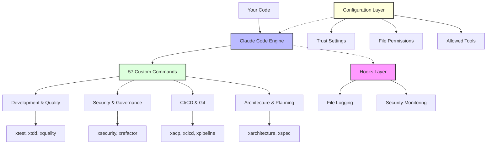

# Claude Code: Advanced Tips Using Commands, Configuration, and Hooks

Eight weeks ago, I started using Claude Code. Claude Code is a super powerful agentic coding AI experience that transforms how developers work. Today, I've built it into a comprehensive platform for AI-assisted development. Here's what I learned and built.

## Why Claude Code Is Different

Most AI coding tools live inside your IDE. Claude Code doesn't. It's a terminal application that works with your existing workflow. This flexibility is what makes it powerful—and what let me build something bigger.

## Getting Started Takes Minutes

```bash
npm install -g @anthropic-ai/claude-code
cd your-repo
claude
```

That's it. Now ask it questions:
- "What does this repo do?"
- "Find dead code"
- "What's the architecture here?"

But the real power comes from three key components: Configuration, Slash Commands, and Hooks.

## Three Key Components

### 1. Configuration: Control Everything

Claude Code's [configuration system](https://docs.anthropic.com/en/docs/claude-code/settings) determines what your AI can and can't do:

- **Trust Settings**: What Claude can access
- **File Permissions**: Read/write boundaries
- **Allowed Tools**: Enable specific capabilities
- **Authentication**: Web login (use this) or API keys for CI/CD

I started with ideas from [Patrick Debois](https://gist.github.com/jedi4ever/762ca6746ef22b064550ad7c04f3bd2f) and evolved them through real use.

### 2. Slash Commands: Automate Everything

Claude Code ships with 50+ built-in commands. Here are a few:
- `/init` - Project setup
- `/review` - Code feedback
- `/model` - Switch models for different tasks

But custom commands are where it gets interesting. These are markdown files in `.claude` directories. After losing work to filesystem issues, I now version control everything in my [Claude Code repository](https://github.com/PaulDuvall/claude-code).

### 3. Hooks: Govern Everything

Hooks are shell scripts that intercept Claude's operations at specific points - before tools run, after they complete, or when prompts are submitted. They can examine the action and approve, modify, or block it. 

This file logger hook runs whenever Claude edits, writes, or modifies files - it simply logs what happened:
```bash
#!/usr/bin/env bash
set -euo pipefail

# File Logger Hook
HOOK_NAME="file-logger"
LOG_FILE="$HOME/.claude/logs/file-logger.log"

# Ensure log directory exists
mkdir -p "$(dirname "$LOG_FILE")"

log() {
    echo "[$(date +'%Y-%m-%d %H:%M:%S')] [$HOOK_NAME] $*" | tee -a "$LOG_FILE"
}

main() {
    local tool_name="${CLAUDE_TOOL:-unknown}"
    local file_path="${CLAUDE_FILE:-unknown}"
    
    log "Hook triggered for tool: $tool_name on file: $file_path"
    
    # Always allow the operation to proceed
    exit 0
}

main "$@"
```

Place hooks in `.claude/hooks/` and they'll run automatically. Learn more in the [Claude Code hooks documentation](https://docs.anthropic.com/en/docs/claude-code/hooks). They're your safety net—the difference between a simple tool and a comprehensive platform.

## System Architecture



## My Implementation

I built [CLAUDE.md](https://github.com/PaulDuvall/claude-code/blob/main/CLAUDE.md) (inspired by [Paul Hammond](https://github.com/citypaul/.dotfiles/blob/main/claude/.claude/CLAUDE.md)) as Claude's reference guide. It contains:
- Project architecture
- Coding standards
- Team conventions
- Decision history

This context makes every AI suggestion better.

## 57 Custom Commands (And Counting)

I've built [14 active commands](https://github.com/PaulDuvall/claude-code/tree/main/slash-commands/active) for daily use, plus [43 experimental ones](https://github.com/PaulDuvall/claude-code/tree/main/slash-commands/experiments). I use an "x" prefix—it makes custom commands obvious at a glance. You can use whatever prefix works for you:

**Architecture & Design**
- `/xarchitecture` - System design with proven patterns

**Development & Quality**
- `/xtdd` - Test-driven development
- `/xquality` - Code analysis with smart defaults
- `/xrefactor` - Smell detection and fixes
- `/xdebug` - Advanced troubleshooting
- `/xtest` - Intelligent test automation
- `/xspec` - ATDD/BDD requirements

**Security & Compliance**
- `/xsecurity` - Vulnerability scanning

```bash
$ /xsecurity

🔍 Security Scan Results
━━━━━━━━━━━━━━━━━━━━━━
✗ SQL Injection Risk: user_auth.py:42
  └─ Unsanitized input: request.form.get('username')
  └─ Fix: Use parameterized queries
  
✗ Hardcoded Secret: config.py:18
  └─ AWS key exposed: AKIA************
  └─ Fix: Move to environment variables

Generated fixes in: .claude/security-fixes/
Apply with: /xsecurity --apply-fixes
```

**DevOps & Automation**
- `/xcicd` - AWS reference architecture pipelines
- `/xpipeline` - Build optimization
- `/xrelease` - Release orchestration with rollback
- `/xacp` - Git workflow with smart commits

## Creating Your Own Slash Commands

Custom slash commands are just markdown files with a specific structure:

```markdown
---
name: xtest
description: Run intelligent tests
---

# System Prompt

You are a test automation expert. When the user runs /xtest:
1. Analyze the codebase for test coverage
2. Generate missing tests
3. Run test suite with appropriate flags

## Examples

When user types `/xtest coverage`, show coverage report.
When user types `/xtest generate`, create missing tests.
```

Save this in `.claude/commands/xtest.md` (local) or `~/.claude/commands/xtest.md` (global). Claude Code loads it automatically. Learn more about [custom slash commands](https://docs.anthropic.com/en/docs/claude-code/slash-commands).

The key is clear instructions and examples. Claude follows what you write, so be specific about behavior.

## Deployment That Works

My deployment system copies custom commands to `~/.claude/commands/`, making them available in every project on your machine. Here's how it works:

```bash
# Deploy active commands (default) - copies to global directory
./deploy.sh

# Deploy experimental commands
./deploy.sh --experiments

# Deploy specific commands only
./deploy.sh --include xtest xquality

# Deploy everything
./deploy.sh --all
```

The script validates each command, backs up existing ones, and ensures proper permissions. Once deployed, these commands work in any repository—no per-project setup needed.

**⚠️ Before Deployment:** Always review what you're deploying:
```bash
# Preview what will be deployed (ALWAYS do this first)
./deploy.sh --dry-run --all

# Review specific commands before deploying
cat slash-commands/active/xtest.md

# Then deploy with confidence
./deploy.sh
```

Example workflow:
```bash
# Test GitHub Actions locally before pushing
./deploy.sh --experiments --include xact --dry-run  # Preview first
./deploy.sh --experiments --include xact            # Then deploy
claude
/xact --install-deps  # Auto-install nektos/act and Docker
/xact                 # Test workflows locally
```

## Hooks That Demonstrate The System

My [file logger hook](https://github.com/PaulDuvall/claude-code/tree/main/hooks) shows how the hook system works by logging file operations:
- Logs all Edit, Write, MultiEdit operations
- Shows file information (size, lines, type)
- Never blocks operations - purely educational
- Perfect for understanding hook mechanics

When it runs:
1. Logs the operation details
2. Shows file metadata
3. Always allows the operation to proceed
4. Creates an audit trail

Real example:
```bash
# Edit any file - hook will log but never block:
echo "print('Hello World')" > test.py

# Hook output in ~/.claude/logs/file-logger.log:
# [2025-01-19 10:30:15] [file-logger] Hook triggered!
# [2025-01-19 10:30:15] [file-logger] Tool: Write
# [2025-01-19 10:30:15] [file-logger] File: test.py
# [2025-01-19 10:30:15] [file-logger] File size: 22 bytes
# [2025-01-19 10:30:15] [file-logger] Operation allowed - no blocking behavior
```

This hook is safe for any environment and helps you understand how hooks integrate with Claude Code's operation flow.

## Three Scripts That Do The Heavy Lifting

### [setup.sh](https://github.com/PaulDuvall/claude-code/blob/main/setup.sh) - One-Command Setup
```bash
./setup.sh                          # Basic
./setup.sh --setup-type demo        # With demo hooks
./setup.sh --setup-type enterprise  # Advanced governance
```

### [configure-claude-code.sh](https://github.com/PaulDuvall/claude-code/blob/main/configure-claude-code.sh) - Safe Configuration
```bash
./configure-claude-code.sh --dry-run  # Preview
./configure-claude-code.sh            # Apply with backups
```

### [deploy.sh](https://github.com/PaulDuvall/claude-code/blob/main/deploy.sh) - Smart Deployment

**Deployment Options:**
- `--experiments` - Deploy experimental commands
- `--all` - Deploy both active and experimental commands  
- `--include <cmd>` - Deploy specific commands only
- `--exclude <cmd>` - Exclude specific commands
- `--dry-run` - Preview deployment without changes
- `--list` - List available commands
- `--remove` - Remove all x-prefixed commands
- `--reset` - Remove commands and reset environment

**Examples:**
```bash
./deploy.sh --dry-run --all          # Preview all deployments
./deploy.sh --include xtest xquality  # Deploy specific commands
./deploy.sh --exclude xdebug         # Deploy all except xdebug
./deploy.sh --list                   # See available commands
```

All scripts include dry-run modes, automatic backups, and comprehensive validation. They're designed for real workflows, not just demos.

## A Day in the Life: Building a New Feature

**9:00 AM - Start with requirements**
```bash
$ /xspec "User authentication with OAuth2"
→ Generates: BDD specs, acceptance criteria, test cases
```

**9:30 AM - TDD implementation**
```bash
$ /xtdd --component UserAuth
→ Creates: Failing tests → Implementation → Green tests → Refactor
```

**10:00 AM - Security check**
```bash
$ /xsecurity
→ Finds: 2 OWASP vulnerabilities, generates fixes
```

**10:15 AM - Deploy**
```bash
$ /xcicd --deploy staging
→ Runs: existing test suite, 3 security scans, deploys in 4 min
```

Total time: 75 minutes for a feature that used to take 2 days.

## Implementation: Security-First Approach

Things move fast with Claude Code, but security comes first. Here's a practical approach:

1. **Day 1**: Install Claude Code, explore built-in commands, **review all scripts before running**
2. **Day 2-3**: **Thoroughly examine** my custom commands, understand their implementation, test with `--dry-run`
3. **Day 4-5**: Create your first custom command **after understanding** the patterns
4. **Week 2**: Add hooks **only after reviewing** their security implications

**⚠️ Critical Security Principle:** Never run automation scripts without understanding what they do. These tools modify your development environment and could impact your workflows.

The key is to experiment **safely**. Review, understand, then adapt the commands to your needs.

## Problems This Solves

### Governance Without Friction
- Enforces standards automatically
- Prevents vulnerabilities before commit
- Creates audit trails

### Works With What You Have
- Fits existing git workflows
- Integrates with current CI/CD
- Complements other tools

### Consistent Quality
- AI follows team patterns
- Same quality across developers
- Reduces technical debt automatically

## What I Learned

1. **Start Small**: Fix one workflow, then expand
2. **Version Everything**: Commands and hooks are code
3. **Test Scripts**: Automation needs testing
4. **Document Context**: CLAUDE.md improves suggestions dramatically
5. **Hook Integration**: Add file logging to understand operations before advanced features

## Results After Eight Weeks

- **14 active commands** for daily work
- **43 experimental commands** for advanced workflows

## Your Next 48 Hours

**Hour 1-2:** Install and run `/xquality` on your worst code  
**Hour 3-4:** Create one custom command for your biggest pain point  
**Day 2:** Deploy to your team, measure the impact

Ready to start? **⚠️ Security First Approach:**

```bash
# 1. Clone and examine the repository
git clone https://github.com/PaulDuvall/claude-code
cd claude-code

# 2. IMPORTANT: Review the code before running anything
cat setup.sh                    # Review setup script
cat configure-claude-code.sh    # Review configuration script
ls slash-commands/active/       # Examine custom commands

# 3. Run with preview mode first (ALWAYS do this)
./setup.sh --dry-run

# 4. Only then proceed with actual installation
./setup.sh
```

**🔒 Security Note:** These scripts modify your Claude Code configuration and install custom commands. Always review scripts before execution, especially when they handle authentication or modify system settings.

## The Bottom Line

Claude Code isn't just another AI tool—it's a platform for building your own AI-assisted development environment. With custom commands, hooks, and automation, you get the benefits of AI without sacrificing control, security, or quality.

The key? Build incrementally. Understand what you need. Maintain governance. My implementation proves this works—delivering measurable improvements while enhancing security.

Start small. Think big. Ship code.

---

*Thanks to [Paul Hammond](https://github.com/citypaul/.dotfiles/blob/main/claude/.claude/CLAUDE.md) and [Patrick Debois](https://gist.github.com/jedi4ever/762ca6746ef22b064550ad7c04f3bd2f) for patterns that shaped this approach.*